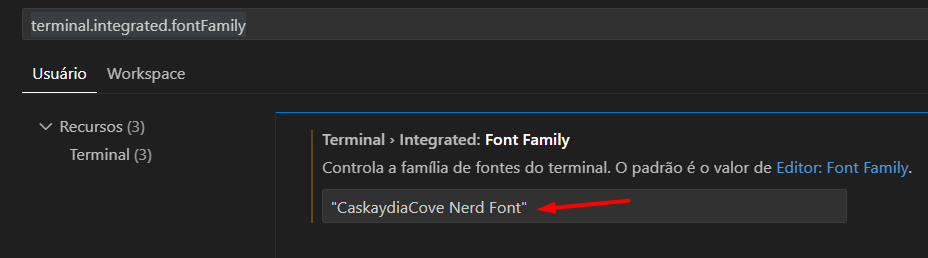

# Configurando Fontes Diferentes para o Editor e Terminal no VS Code
* *Autor: Michel*
* *Data: 15/06/2025*
* *Categoria: editor*

### Você quer usar fontes diferentes para o editor de código e para o terminal no Visual Studio Code (VS Code)?

É uma configuração bem comum e desejável querer fontes diferentes para o editor de código e para o terminal no VS Code, especialmente ao usar prompts estilizados como `Oh My Posh`.

### Veja como fazer:

**Passo 1:** Instalar as Fontes Necessárias

Você precisará de duas fontes principais instaladas no seu sistema:

Para o Terminal (com Oh My Posh): `Uma Nerd Font`.

**Recomendação:** MesloLGS NF. É a fonte frequentemente recomendada pelo próprio Oh My Posh e tem excelente cobertura de glifos.

**Onde baixar:** Nerd Fonts [link](https://www.nerdfonts.com/font-downloads) - Meslo (procure por "Meslo" na lista, baixe e instale a variação MesloLGS NF Regular ou o pacote completo).

**Outras opções:** FiraCode Nerd Font, Hack Nerd Font, JetBrainsMono Nerd Font.

**Para o Editor de Código:** Uma fonte popular para desenvolvedores.

**Recomendação:** Fira Code. É extremamente popular, gratuita, e conhecida por suas ótimas ligaduras de programação (ex: => vira uma seta única).

**Onde baixar:** GitHub - Fira Code  [link](https://github.com/tonsky/FiraCode) (vá para a seção "Releases" para baixar os arquivos TTF).

**Outras opções populares:**

`JetBrains Mono` (excelente, também com ligaduras)

`Cascadia Code` (da Microsoft, também com ligaduras)

`Source Code Pro`

`Consolas` (já vem com o Windows, mas Fira Code é geralmente preferida por mais recursos)

### Como instalar as fontes

**(após baixar os arquivos .ttf ou .otf):**

**Windows:** Clique com o botão direito no arquivo da fonte e selecione "Instalar" ou "Instalar para todos os usuários".

**Linux:** Copie os arquivos para ~/.local/share/fonts/ (para o usuário atual) ou /usr/local/share/fonts/ (para todos os usuários) e depois rode fc-cache -fv.

**macOS:** Dê um duplo clique no arquivo da fonte e clique em "Instalar Fonte" no aplicativo Catálogo de Fontes.

**Passo 2:** Configurar o VS Code

Agora, vamos dizer ao VS Code qual fonte usar para cada área:

Abra o VS Code.

Abra as Configurações:

Use o atalho `Ctrl + ,` (vírgula)

Ou vá em File **> Preferences > Settings** (Arquivo > Preferências > Configurações).

É mais fácil editar diretamente o arquivo `settings.json`. Para abri-lo:

Pressione `Ctrl + Shift + P` para abrir a paleta de comandos.

Digite `Preferences: Open User Settings (JSON)` e selecione essa opção.

No seu arquivo `settings.json`, adicione ou modifique as seguintes linhas:
```json
{
    // --- Configurações do Editor ---
    "editor.fontFamily": "'Fira Code', Consolas, 'Courier New', monospace", // Fonte para o editor
    "editor.fontLigatures": true,                                    // Habilita ligaduras para Fira Code (opcional, mas recomendado)
    "editor.fontSize": 14,                                           // Tamanho da fonte do editor (ajuste como preferir)

    // --- Configurações do Terminal Integrado ---
    "terminal.integrated.fontFamily": "'MesloLGS NF', monospace",       // Fonte para o terminal (com Oh My Posh)
    "terminal.integrated.fontSize": 13,                               // Tamanho da fonte do terminal (ajuste como preferir)

    // ... outras configurações que você já possa ter ...
}
```

Explicação das configurações:

**editor.fontFamily:**

'Fira Code' é a primeira escolha. As aspas simples são boas se o nome da fonte tiver espaços.

Consolas, 'Courier New', monospace são fontes de fallback. Se Fira Code não for encontrada, ele tentará Consolas, depois Courier New, e por último qualquer fonte monoespaçada padrão.

**editor.fontLigatures:**

Se você estiver usando uma fonte como Fira Code ou JetBrains Mono que suporta ligaduras de programação (ex: != se torna ≠, => se torna ⇒), defina isso como true para ativá-las. Se não quiser ligaduras, defina como false ou remova a linha.

**terminal.integrated.fontFamily:**

'MesloLGS NF' é a escolha para o terminal, garantindo que os ícones do Oh My Posh sejam exibidos corretamente.
As aspas simples são usadas por causa dos espaços no nome. O fallback monospace é genérico, garantindo que sempre haja uma fonte monoespaçada disponível.

**outras fontes:**
Se você preferir usar outra fonte para o terminal, substitua 'MesloLGS NF' pelo nome da fonte que você instalou.
exemplo: 'Cascadia Code', 'Fira Code', 'JetBrains Mono', etc.


monospace é um fallback genérico.

fontSize: Ajuste o tamanho da fonte para o editor e terminal de acordo com sua preferência para cada um (ex: editor.fontSize e terminal.integrated.fontSize).

**Passo 3:** Verificar

Salve o arquivo `settings.json`.

Pode ser necessário reiniciar o VS Code para que todas as alterações de fonte tenham efeito completo, especialmente no terminal.

Abra um novo terminal integrado no VS Code. Você deve ver os ícones do Oh My Posh corretamente.

Abra um arquivo de código no editor. Você deve ver a fonte Fira Code (ou a que você escolheu) com as ligaduras ativadas (se configurado).

Agora você terá uma experiência visual otimizada tanto para a leitura de código no editor quanto para a visualização do seu prompt estilizado no terminal!