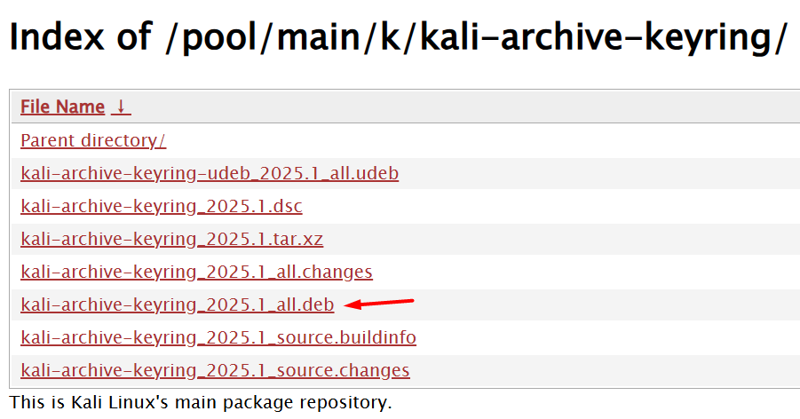

# Chave de segurança (chave GPG) para atualizar repositórios APT no Linux

# Este guia aborda como resolver o erro de chave GPG ausente ao atualizar repositórios

# Kali Linux, Debian ou Ubuntu.
## O erro comum é algo como:

```plaintext
W: GPG error: https://archive.kali.org/kali kali-rolling InRelease: The following signatures were invalid: EXPKEYSIG 74A941BA219BD9C9 Kali Linux Repository <

```

**Solução 1 (Recomendada):** Reinstalar o Pacote de Chaves do Kali
Este método é o mais seguro e garantido, pois instala o pacote oficial mantido pela equipe do Kali.
Baixe o pacote kali-archive-keyring mais recente:
Abra o terminal e use o wget para baixar o pacote diretamente do repositório.
```bash
wget https://http.kali.org/kali/pool/main/k/kali-archive-keyring/kali-archive-keyring_2025.1_all.deb
```
(Nota: Se este link estiver quebrado no futuro, você pode encontrar a versão mais recente navegando até https://http.kali.org/kali/pool/main/k/kali-archive-keyring/)


```bash
sudo dpkg -i kali-archive-keyring_2025.1_all.deb
```
Limpe o arquivo baixado (opcional):
```bash
rm kali-archive-keyring_2025.1_all.deb
```
As novas chaves já devem estar no lugar.
```bash
sudo apt update
```
O erro deve ter desaparecido e o apt conseguirá atualizar a lista de pacotes normalmente.
```bash
sudo apt upgrade
```
```bash
sudo apt dist-upgrade
```

**Solução 2 (Alternativa): Adicionar a Chave Manualmente**
Se você preferir adicionar a chave manualmente, siga estes passos:
```bash
wget -qO - https://archive.kali.org/kali/pool/main/k/kali-archive-keyring/kali-archive-keyring_2025.1_all.deb | sudo dpkg -i -
```
```bash
sudo apt update
```
```bash
sudo apt upgrade
```
```bash
sudo apt dist-upgrade
```
```bash
sudo apt autoremove
```
## Links úteis:
- [Kali Linux Archive Keyring](https://http.kali.org/kali/pool/main/k/kali-archive-keyring/)
- [Kali Linux Official Documentation](https://www.kali.org/docs/general-use/kali-linux-archive-keyring/)
- [Debian Keyring](https://wiki.debian.org/DebianArchiveKeyring)
- [Ubuntu Keyring](https://help.ubuntu.com/community/Repositories/CommandLine#ImportingGPGKeys)
- [APT Key Management](https://wiki.debian.org/AptKey)