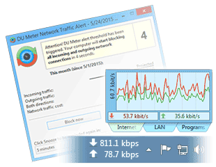

# Monitoramento de Tráfego de Rede no Windows

Infelizmente, o Windows **não possui uma funcionalidade nativa** que mostre o tráfego de rede em tempo real diretamente na barra de tarefas ou como um ícone numérico na bandeja do sistema (ao lado do relógio) de forma contínua e visível, como alguns utilitários de terceiros fazem.

A maneira nativa mais próxima é usar o **Gerenciador de Tarefas**:

1.  **Clique com o botão direito na barra de tarefas** e selecione **"Gerenciador de Tarefas"**.
2.  Vá para a aba **"Desempenho"**.
3.  Selecione sua conexão de rede ativa (por exemplo, **"Ethernet"** ou **"Wi-Fi"**) na coluna da esquerda.
    *   Você verá gráficos de envio e recebimento e os valores numéricos atuais.
    *   Você pode clicar com o botão direito no gráfico e selecionar **"Exibir resumo da rede"** para uma janela menor que pode ser mantida em cima de outras, mas ainda é uma janela separada, não integrada à barra de tarefas.

**Para ter o tráfego de rede visível na barra de tarefas ou na bandeja do sistema, você precisará de aplicativos de terceiros.** Aqui estão algumas opções populares e geralmente bem conceituadas:

### 1. TrafficMonitor (GitHub):
*   **O que é:** Um utilitário leve e de código aberto que pode exibir a velocidade da rede na barra de tarefas, além de informações de CPU e memória.
*   **Funcionalidades:**
    *   Exibe a velocidade de upload/download na barra de tarefas (parecido com o monitor de rede do Windows 7).
    *   Pode mostrar um ícone na bandeja do sistema com informações.
    *   Monitoramento de CPU e RAM.
    *   Altamente personalizável (cor, fonte, unidades de exibição).
    *   Portátil (não requer instalação em alguns casos).
*   **Onde encontrar:** Geralmente no GitHub. Procure por `TrafficMonitor` (o do desenvolvedor `zhongyang219` ou forks populares).
*   **Como usar:** Baixe o executável, execute-o. Ele deve adicionar um pequeno monitor à sua barra de tarefas. Você pode clicar com o botão direito nele para acessar as configurações.

*   **Página Principal do Projeto (Repositório de `zhongyang219`):**
    `[TrafficMonitor (zhongyang219 on GitHub)](https://github.com/zhongyang219/TrafficMonitor)`
    *   **Para downloads:** Geralmente, você encontrará os arquivos de instalação ou portáteis na seção "Releases" deste repositório.
    `[TrafficMonitor Releases](https://github.com/zhongyang219/TrafficMonitor/releases)`

### 2. NetSpeedMonitor (descontinuado, mas com forks/versões que funcionam):
*   **O que é:** Um clássico para essa finalidade. O original foi descontinuado, mas existem versões ou forks que funcionam em versões mais recentes do Windows (incluindo Windows 10 e 11, às vezes com modo de compatibilidade).
*   **Funcionalidades:**
    *   Adiciona uma pequena barra diretamente na sua barra de tarefas mostrando as velocidades de upload e download.
    *   Personalizável.
*   **Onde encontrar:** Pesquise por `NetSpeedMonitor` e procure por versões compatíveis com seu sistema operacional. Sites como o MajorGeeks ou o Softpedia costumavam hospedar o original e podem ter links para alternativas.
*   **Observação:** Por ser mais antigo, a instalação pode exigir a execução em modo de compatibilidade no Windows 10/11.

Como o original foi descontinuado, não há um "link oficial" único. Você precisará procurar por versões que foram adaptadas ou que funcionam com modo de compatibilidade. Sites de download de software confiáveis são um bom lugar para começar a procurar por "NetSpeedMonitor".

*   **Exemplo de link (MajorGeeks - verifique a compatibilidade e a data):**
    `[NetSpeedMonitor (MajorGeeks - pode precisar de modo de compatibilidade)](https://www.majorgeeks.com/files/details/netspeedmonitor_32_bit.html)`
    *(Nota: Este link específico é para a versão de 32 bits; procure por versões de 64 bits se necessário e sempre verifique os comentários e a compatibilidade com o seu sistema operacional. A instalação no Windows 10/11 geralmente requer a execução do instalador em modo de compatibilidade com o Windows 7).*

### 3. DU Meter:
*   **O que é:** Um software comercial (pago, com período de teste) mais robusto.
*   **Funcionalidades:**
    *   Mostra gráficos em tempo real e pode ter um modo de exibição compacto ou na bandeja.
    *   Relatórios detalhados de uso, alertas, cronômetro.
    *   Mais recursos do que os gratuitos, mas tem um custo.
*   **Onde encontrar:** No site oficial do DU Meter.

*   **Site Oficial:**
    `[DU Meter (Official Website)](https://www.dumeter.com/)`
    *   **Página de Download:** Geralmente, o link de download está proeminente na página inicial ou em uma seção "Download".
    `[DU Meter Download (via site oficial)](https://www.dumeter.com/download/)`

### 4. GlassWire:
*   **O que é:** Mais do que apenas um monitor de tráfego; é também um firewall e uma ferramenta de segurança de rede.
*   **Funcionalidades:**
    *   Possui um "mini-gráfico" que pode ser mantido sempre visível na tela (não diretamente na barra de tarefas, mas flutuante).
    *   Mostra quais aplicativos estão usando a rede.
    *   A versão gratuita tem algumas limitações, mas o monitoramento básico está presente.
*   **Onde encontrar:** No site oficial do GlassWire.

*   **Site Oficial:**
    `[GlassWire (Official Website)](https://www.glasswire.com/)`
    *   **Página de Download:**
    `[GlassWire Download Page](https://www.glasswire.com/download/)`

## Recomendação:

Para uma solução gratuita, leve e que se integra bem à barra de tarefas, o **TrafficMonitor (do GitHub)** é atualmente uma das melhores opções e mais ativamente mantidas.

**Ao instalar qualquer software de terceiros, sempre baixe de fontes oficiais ou repositórios confiáveis para evitar malware.**