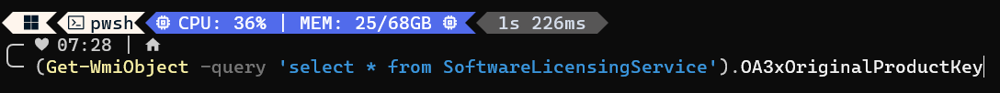

# Como encontrar a chave de licença do Windows pelo terminal
Você pode tentar descobrir a chave da licença do Windows (Product Key) pelo terminal (Prompt de Comando ou PowerShell) de algumas maneiras. É importante notar que:

1.  **Chaves OEM:** Se o seu Windows veio pré-instalado de fábrica (OEM), a chave geralmente está embutida no firmware (BIOS/UEFI) da placa-mãe. Esses comandos costumam conseguir recuperá-la.
2.  **Chaves Retail/Volume:** Se você comprou uma licença separadamente (Retail) ou usa uma licença de volume (MAK), o resultado pode variar.
3.  **Licença Digital:** Se você atualizou para o Windows 10/11 a partir de uma versão anterior qualificada ou comprou o Windows 10/11 na Microsoft Store, você provavelmente tem uma licença digital vinculada à sua conta Microsoft e ao hardware. Nesses casos, uma chave de produto tradicional pode não ser exibida ou pode ser uma chave genérica.
4.  **Privilégios de Administrador:** Você pode precisar executar o terminal como administrador.

Aqui estão os métodos:

## Método 1: Usando o PowerShell (Recomendado)

Este comando consulta o serviço de licenciamento de software para obter a chave original OA3 (OEM Activation 3.0), que é como as chaves embutidas no firmware são geralmente armazenadas.

1.  Abra o **PowerShell como Administrador**:
    *   Clique no menu Iniciar, digite "powershell".
    *   Clique com o botão direito em "Windows PowerShell" e selecione "Executar como administrador".
2.  Copie e cole o seguinte comando e pressione Enter:

    ```powershell
    (Get-WmiObject -query 'select * from SoftwareLicensingService').OA3xOriginalProductKey
    ```
entrada:

saída:

    Ou uma alternativa um pouco mais moderna usando `Get-CimInstance`:

    ```powershell
    Get-CimInstance -ClassName SoftwareLicensingService | Select-Object -ExpandProperty OA3xOriginalProductKey
    ```

3.  Se uma chave estiver embutida no firmware, ela será exibida.

## Método 2: Usando o Prompt de Comando (CMD)

Este comando usa o WMIC (Windows Management Instrumentation Command-line) para obter a mesma informação.

1.  Abra o **Prompt de Comando como Administrador**:
    *   Clique no menu Iniciar, digite "cmd".
    *   Clique com o botão direito em "Prompt de Comando" e selecione "Executar como administrador".
2.  Copie e cole o seguinte comando e pressione Enter:

    ```cmd
    wmic path softwarelicensingservice get OA3xOriginalProductKey
    ```
3.  A chave do produto (se encontrada no firmware) será exibida.

## O que fazer se os comandos não mostrarem uma chave ou mostrarem uma chave genérica?

*   **Licença Digital:** Como mencionado, você pode ter uma licença digital. Nesse caso, o Windows é ativado automaticamente quando você se conecta à internet com sua conta Microsoft (se a licença estiver vinculada a ela) ou com base no hardware do seu PC. Você pode verificar o status da ativação em `Configurações > Atualização e Segurança > Ativação` (Windows 10) ou `Configurações > Sistema > Ativação` (Windows 11).
*   **Chave Retail em Caixa:** Se você comprou uma cópia física (caixa) do Windows, a chave estará em um adesivo dentro da embalagem ou no cartão.
*   **Chave Retail Digital:** Se comprou digitalmente de um revendedor, a chave geralmente é enviada por e-mail.
*   **Conta Microsoft:** Se você vinculou sua licença do Windows à sua conta Microsoft, pode ser possível visualizá-la ou gerenciá-la através do site da Microsoft, embora eles geralmente não mostrem a chave completa por motivos de segurança, mas confirmam a existência da licença.

Lembre-se que esses comandos são mais eficazes para recuperar chaves OEM embutidas no firmware.