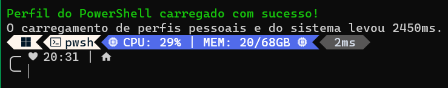

* *Autor: Michel*
* *Data: 15/06/2025*
* *Categoria: terminal*

para o perfil no powershell do exemplo abaixo, você precisa instalar o Oh My Posh e o Terminal-Icons.
modificar 2 arquivos, o $PROFILE do PowerShell e o arquivo de configuração do Oh My Posh (clean-detailed.omp.json).



### abra o PowerShell como administrador e execute os seguintes comandos:
```powershell
# Para abrir com o VS Code
code $PROFILE

# Ou para abrir com o Bloco de Notas
notepad $PROFILE
```
cole o seguinte código (abaixo) no arquivo aberto e salve:
depois, feche e reabra o PowerShell para aplicar as mudanças.

```powershell
# --- Configuração do Chocolatey ---
# Habilita o auto-completar para o 'choco'. É uma boa prática manter isso no topo.
$ChocolateyProfile = "$env:ChocolateyInstall\helpers\chocolateyProfile.psm1"
if (Test-Path($ChocolateyProfile)) {
  Import-Module "$ChocolateyProfile"
}


# --- Módulos Principais ---
# Importa os módulos para melhorar a experiência do terminal.
# Terminal-Icons é preferível sobre Get-ChildItemColor por ser mais moderno.
Import-Module -Name Terminal-Icons
Import-Module -Name PSReadLine
Import-Module -Name posh-git


# --- Configuração do Prompt (Oh My Posh) ---
# Inicializa o Oh My Posh usando um caminho absoluto para o tema, garantindo que ele sempre funcione.
# $PSScriptRoot é a pasta onde este arquivo de perfil está salvo (ex: C:\Users\SeuNome\Documents\PowerShell).
oh-my-posh init pwsh --config "$PSScriptRoot\temas-oh-my-posh\clean-detailed.omp.json" | Invoke-Expression


# --- Configurações do PSReadLine (Edição e Histórico) ---
Set-PSReadLineOption -MaximumHistoryCount 20000
Set-PSReadLineKeyHandler -Key Tab -Function MenuComplete

# --- BLOCO PARA REMOVER ---
# Salva o histórico de comandos ao fechar o PowerShell
$HistoryFilePath = Join-Path ([Environment]::GetFolderPath('UserProfile')) ".ps_history"
Register-EngineEvent PowerShell.Exiting -Action { Get-History | Export-Clixml $HistoryFilePath } | Out-Null
# Carrega o histórico ao iniciar uma nova sessão
if (Test-Path $HistoryFilePath) {
    Import-Clixml $HistoryFilePath | Add-History
}
# Configura o PSReadLine para salvar/carregar o histórico automaticamente.
# Este método é mais moderno e seguro, salvando os comandos à medida que são executados.
#Set-PSReadLineOption -HistorySaveStyle SaveIncrementally
#Set-PSReadLineOption -HistorySavePath (Join-Path ([Environment]::GetFolderPath('UserProfile')) ".ps_history")

# Configura as setas para cima/baixo para pesquisar no histórico
Set-PSReadLineOption -HistorySearchCursorMovesToEnd
Set-PSReadLineKeyHandler -Key UpArrow -Function HistorySearchBackward
Set-PSReadlineKeyHandler -Key DownArrow -Function HistorySearchForward

# Ativa as dicas e previsões de comando com base no histórico
Set-PSReadLineOption -ShowToolTips
Set-PSReadLineOption -PredictionSource History


# --- Aliases e Funções Customizadas ---
# Aliases para comandos comuns de outros sistemas
Set-Alias -Name which -Value Get-Command -Option AllScope
Set-Alias -Name open -Value Invoke-Item -Option AllScope

# Funções para diferentes formatos de listagem de arquivos
function ll { Get-ChildItem | Format-Table }
function la { Get-ChildItem | Format-Wide }
function lb { Get-ChildItem | Format-List }

# Substitui o 'ls' padrão para usar a função 'la' (listagem em colunas)
# -Force é necessário para sobrescrever o alias padrão
Set-Alias -Name ls -Value la -Force -Option AllScope
Set-Alias -Name l -Value lb -Option AllScope

Write-Host "Perfil do PowerShell carregado com sucesso!" -ForegroundColor Green
```

### Configuração do Oh My Posh
Para configurar o Oh My Posh, você precisa criar um diretório para os temas e colocar o arquivo de configuração `clean-detailed.omp.json` dentro dele.

```powershell
# Cria o diretório para os temas do Oh My Posh
$ThemeDir = "$HOME\.config\powershell\temas-oh-my-posh"
New-Item -ItemType Directory -Path $ThemeDir -Force

# Copia o arquivo de configuração para o diretório criado
Copy-Item -Path "caminho\para\clean-detailed.omp.json" -Destination $ThemeDir
```
no arquivo `clean-detailed.omp.json`, você pode personalizar o tema conforme suas preferências. O Oh My Posh possui uma documentação completa sobre como criar e modificar temas.
Veja o exemplo de tema abaixo:

```json
{
  "$schema": "https://raw.githubusercontent.com/JanDeDobbeleer/oh-my-posh/main/themes/schema.json",
  "transient_prompt": {
    "template": "\ue285 ",
    "foreground": "#FEF5ED",
    "background": "transparent"
  },
  "console_title_template": "{{ .Folder }}",
  "blocks": [
    {
      "type": "prompt",
      "alignment": "left",
      "segments": [
        {
          "properties": {
            "macos": "\uf179 ",
            "ubuntu": "\uf31b ",
            "windows": "\uf871 "
          },
          "style": "diamond",
          "leading_diamond": "\ue0b2",
          "trailing_diamond": "<transparent,#FEF5ED>\ue0b2</>",
          "template": " {{ if .WSL }}WSL at {{ end }}{{.Icon}}",
          "foreground": "#011627",
          "background": "#FEF5ED",
          "type": "os"
        },
        {
          "style": "diamond",
          "leading_diamond": "\ue0b2",
          "trailing_diamond": "<transparent,#FEF5ED>\ue0b2</>",
          "template": "\uf489 {{ .Name }}",
          "foreground": "#011627",
          "background": "#FEF5ED",
          "type": "shell"
        },
        {
          "style": "diamond",
          "leading_diamond": "\ue0b2",
          "template": "\uf85a CPU: {{ round .PhysicalPercentUsed .Precision }}% | ",
          "foreground": "#ffffff",
          "background": "#516BEB",
          "type": "sysinfo"
        },
        {
          "style": "diamond",
          "trailing_diamond": "<transparent,#516BEB>\ue0b2</>",
          "template": "MEM: {{ (div ((sub .PhysicalTotalMemory .PhysicalFreeMemory)|float64) 1000000000.0) }}/{{ (div .PhysicalTotalMemory 1000000000.0) }}GB \uf85a ",
          "foreground": "#ffffff",
          "background": "#516BEB",
          "type": "sysinfo"
        },
        {
          "properties": {
            "style": "roundrock",
            "threshold": 0
          },
          "style": "diamond",
          "leading_diamond": "\ue0b2",
          "trailing_diamond": "\ue0b0",
          "template": " {{ .FormattedMs }} ",
          "foreground": "#d6deeb",
          "background": "#575656",
          "type": "executiontime"
        }
      ],
      "newline": true
    },
    {
      "type": "prompt",
      "alignment": "right",
      "segments": [
        {
          "properties": {
            "branch_icon": "\ue725 ",
            "fetch_stash_count": true,
            "fetch_status": true,
            "fetch_upstream_icon": true,
            "fetch_worktree_count": true
          },
          "style": "diamond",
          "leading_diamond": "\ue0b2",
          "trailing_diamond": "\ue0b0",
          "template": " {{ .UpstreamIcon }}{{ .HEAD }}{{ .BranchStatus }}{{ if .Working.Changed }} \uf044 {{ .Working.String }}{{ end }}{{ if and (.Working.Changed) (.Staging.Changed) }} |{{ end }}{{ if .Staging.Changed }} \uf046 {{ .Staging.String }}{{ end }}{{ if gt .StashCount 0 }} \uf692 {{ .StashCount }}{{ end }} ",
          "foreground": "#011627",
          "background": "#17D7A0",
          "type": "git"
        }
      ]
    },
    {
      "type": "prompt",
      "alignment": "left",
      "segments": [
        {
          "style": "plain",
          "template": "\u256d\u2500",
          "foreground": "",
          "background": "",
          "type": "text"
        },
        {
          "properties": {
            "time_format": "15:04"
          },
          "style": "plain",
          "template": " ♥ {{ .CurrentDate | date .Format }} |",
          "foreground": "",
          "background": "",
          "type": "time"
        },
        {
          "style": "plain",
          "template": " \uf292 ",
          "foreground": "",
          "background": "",
          "type": "root"
        },
        {
          "properties": {
            "folder_icon": "\uf07b ",
            "folder_separator_icon": " \uf554 ",
            "home_icon": "\uf7db "
          },
          "style": "plain",
          "template": " {{ .Path }} ",
          "foreground": "",
          "background": "",
          "type": "path"
        }
      ],
      "newline": true
    },
    {
      "type": "prompt",
      "alignment": "left",
      "segments": [
        {
          "properties": {
            "always_enabled": true
          },
          "style": "plain",
          "template": "\u2570\u2500 ",
          "foreground": "",
          "background": "",
          "type": "exit"
        }
      ],
      "newline": true
    }
  ],
  "version": 3
}
```